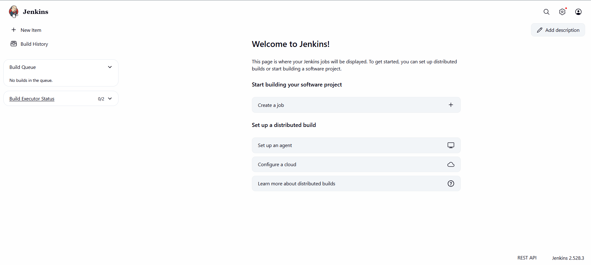
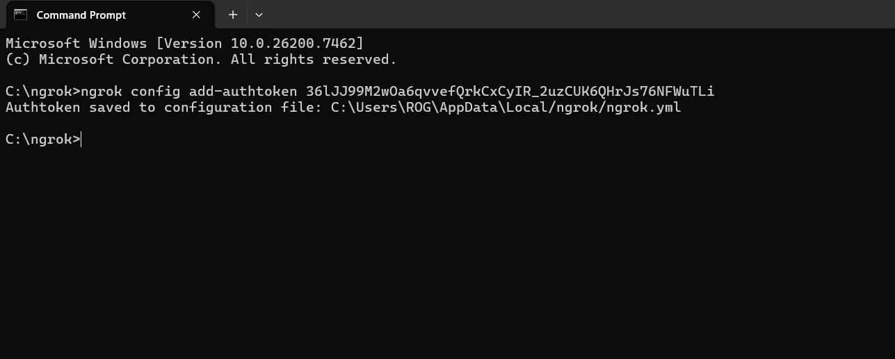
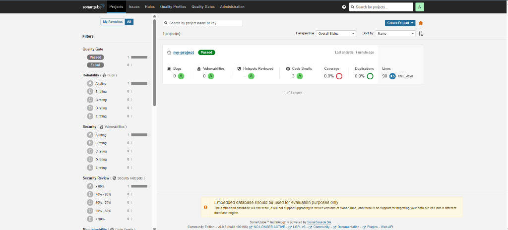
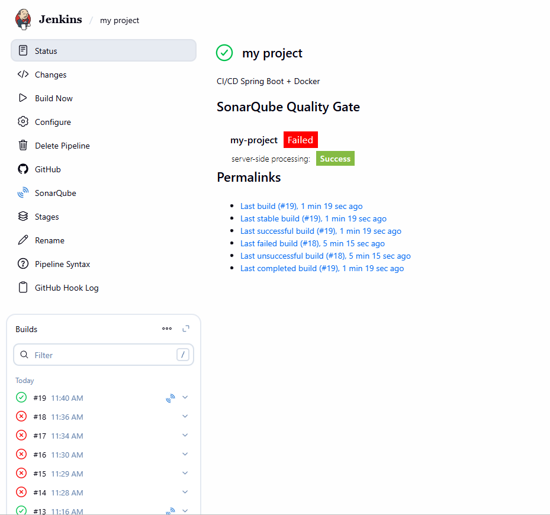

# Jenkins CI/CD Pipeline - Spring Boot Docker Project

Ce projet démontre la mise en place d'un pipeline CI/CD complet avec Jenkins, Docker et GitHub pour une application Spring Boot.

## 📋 Table des matières

- [Vue d'ensemble](#vue-densemble)
- [Prérequis](#prérequis)
- [Guide d'installation étape par étape](#guide-dinstallation-étape-par-étape)
  - [Étape 1: Configuration initiale de Jenkins](#étape-1-configuration-initiale-de-jenkins)
  - [Étape 2: Installation des plugins Jenkins](#étape-2-installation-des-plugins-jenkins)
  - [Étape 3: Configuration du projet Jenkins](#étape-3-configuration-du-projet-jenkins)
  - [Étape 4: Configuration de Ngrok](#étape-4-configuration-de-ngrok)
  - [Étape 5: Configuration du Webhook GitHub](#étape-5-configuration-du-webhook-github)
  - [Étape 6: Exécution du Pipeline](#étape-6-exécution-du-pipeline)
- [Architecture du Projet](#architecture-du-projet)
- [Dockerfile](#dockerfile)

---

## 🎯 Vue d'ensemble

Ce projet implémente une chaîne CI/CD automatisée qui:
- ✅ Récupère le code depuis GitHub
- ✅ Compile l'application Spring Boot avec Maven
- ✅ Construit une image Docker
- ✅ Lance un conteneur Docker
- ✅ Se déclenche automatiquement à chaque push sur GitHub

---

## 🔧 Prérequis

- Java 17 (Eclipse Temurin)
- Maven
- Docker
- Jenkins
- Ngrok (pour exposer Jenkins publiquement)
- Un compte GitHub

---

## 📖 Guide d'installation étape par étape

### Étape 1: Configuration initiale de Jenkins

#### Accès au Dashboard Jenkins
Une fois Jenkins installé et démarré, accédez au dashboard principal.


*Le dashboard Jenkins affiche tous vos projets et pipelines configurés*

---

### Étape 2: Installation des plugins Jenkins

#### Installation des plugins nécessaires
Allez dans **Manage Jenkins** > **Manage Plugins** et installez les plugins requis:
- Docker Pipeline
- GitHub Integration Plugin
- Maven Integration Plugin


*Interface d'installation des plugins Jenkins - sélectionnez les plugins nécessaires pour l'intégration Docker et GitHub*

---

### Étape 3: Configuration du projet Jenkins

#### 3.1 Configuration de base du projet

Créez un nouveau projet de type "Pipeline" et configurez les paramètres de base.


*Configuration initiale du projet Jenkins avec les options générales*

#### 3.2 Description et URL GitHub

Ajoutez une description au projet et configurez l'URL de votre dépôt GitHub.


*Configuration de la description du projet et de l'URL du dépôt GitHub*

#### 3.3 Configuration du Trigger et du Script Pipeline

Configurez le trigger pour déclencher automatiquement le build sur les événements GitHub et ajoutez votre script Pipeline.


*Configuration du déclencheur GitHub webhook et du script Pipeline (Jenkinsfile)*

**Script Pipeline exemple:**
```groovy
pipeline {
    agent any
    
    stages {
        stage('Checkout') {
            steps {
                git branch: 'main', url: 'https://github.com/votre-username/votre-repo.git'
            }
        }
        
        stage('Build with Maven') {
            steps {
                sh 'mvn clean package'
            }
        }
        
        stage('Build Docker Image') {
            steps {
                sh 'docker build -t spring-boot-app .'
            }
        }
        
        stage('Run Docker Container') {
            steps {
                sh 'docker stop spring-boot-app || true'
                sh 'docker rm spring-boot-app || true'
                sh 'docker run -d -p 8080:8080 --name spring-boot-app spring-boot-app'
            }
        }
    }
}
```

---

### Étape 4: Configuration de Ngrok

#### 4.1 Démarrage de Ngrok

Ngrok permet d'exposer votre instance Jenkins locale sur Internet pour recevoir les webhooks GitHub.


*Commande pour démarrer Ngrok: `ngrok http 8080` (ou le port de votre Jenkins)*

#### 4.2 Récupération de l'URL Ngrok

Copiez l'URL HTTPS fournie par Ngrok (ex: `https://xxxx.ngrok.io`).


*URL publique générée par Ngrok - utilisez cette URL pour configurer le webhook GitHub*

#### 4.3 Connexion à Jenkins via Ngrok

Utilisez l'URL Ngrok pour accéder à Jenkins depuis l'extérieur.


*Accès à Jenkins via l'URL publique Ngrok*

---

### Étape 5: Configuration du Webhook GitHub

#### 5.1 Configuration du Webhook

Dans votre dépôt GitHub, allez dans **Settings** > **Webhooks** > **Add webhook** et configurez:
- **Payload URL**: `https://votre-url-ngrok.io/github-webhook/`
- **Content type**: `application/json`
- **Events**: Sélectionnez "Just the push event"


*Configuration du webhook GitHub avec l'URL Ngrok de Jenkins*

#### 5.2 Vérification des livraisons

Vérifiez que les webhooks sont bien reçus dans l'onglet "Recent Deliveries".


*Historique des livraisons de webhook - vérifiez que le statut est 200 OK*

---

### Étape 6: Exécution du Pipeline

#### 6.1 Build en cours et terminé

Une fois le webhook configuré, chaque push déclenche automatiquement le pipeline.


*Début de l'exécution du pipeline Jenkins*


*Progression du build - compilation Maven, construction de l'image Docker*


*Suite de l'exécution du pipeline*


*Finalisation du build et déploiement du conteneur Docker*

#### 6.2 Pipeline Terminé avec Succès


*Pipeline exécuté avec succès - toutes les étapes sont en vert ✅*

#### 6.3 Vue des Stages

Visualisation détaillée de chaque étape du pipeline.


*Vue détaillée des différentes stages du pipeline avec leur durée d'exécution*

---

## 📊 Quality Analysis with SonarQube

### Tableau de bord SonarQube

Le projet est analysé avec SonarQube pour assurer la qualité du code et détecter les problèmes potentiels.


*Tableau de bord SonarQube montrant les métriques de qualité du code*

**Métriques de qualité:**
- ✅ **0 Bugs** - Aucun bug détecté
- ✅ **0 Vulnerabilities** - Aucune vulnérabilité de sécurité
- ⚠️ **1 Hotspot Reviewed** - Point sensible de sécurité examiné
- 📝 **3 Code Smells** - 3 problèmes de maintenabilité détectés
- 📈 **Coverage** - Couverture du code par les tests
- 🔄 **Duplications** - 0.0% de duplication de code
- 📏 **50 Lines** - 50 lignes de code XML analysées

### Intégration SonarQube dans le Pipeline

Pour intégrer SonarQube dans votre pipeline Jenkins, ajoutez une étape d'analyse:

```groovy
stage('SonarQube Analysis') {
    steps {
        withSonarQubeEnv('SonarQube') {
            sh 'mvn sonar:sonar'
        }
    }
}
```

#### Vue Jenkins - SonarQube Quality Gate

L'intégration de SonarQube dans Jenkins permet de visualiser les résultats d'analyse directement dans l'interface Jenkins.


*Interface Jenkins montrant le statut du Quality Gate SonarQube*

**Fonctionnalités affichées:**
- ✅ **Status du build** - Indication visuelle du succès/échec
- 🔍 **SonarQube Quality Gate** - Statut de la qualité du code (Passed/Failed)
- 📋 **Permalinks** - Liens vers les builds récents
- 🕐 **Historique des builds** - Liste chronologique des exécutions
- 🔗 **Intégration GitHub** - Déclenchement automatique via webhook

**Configuration du Quality Gate:**
Le Quality Gate peut échouer si les critères de qualité ne sont pas respectés:
- Présence de bugs critiques
- Vulnérabilités de sécurité
- Couverture de tests insuffisante
- Duplication de code excessive
- Dette technique trop élevée

---

## 🏗️ Architecture du Projet

```
POV-JAVA/
├── src/
│   └── main/
│       ├── java/
│       └── resources/
├── images/              # Screenshots de la configuration
├── Dockerfile           # Configuration Docker
├── pom.xml             # Configuration Maven
├── Jenkinsfile         # Pipeline as Code (optionnel)
└── README.md           # Ce fichier
```

---

## 🧪 Tests

Le projet inclut des tests unitaires et des tests d'intégration pour assurer la qualité du code.

### Structure des Tests

```
src/test/java/
└── com/example/Point/of/sale/
    ├── PointOfSaleApplicationTests.java         # Test de contexte Spring
    └── controller/
        ├── HelloControllerTest.java              # Tests unitaires
        └── HelloControllerIntegrationTest.java   # Tests d'intégration
```

### Types de Tests

#### 1. Tests Unitaires (`HelloControllerTest`)
Tests rapides utilisant `MockMvc` pour tester les endpoints sans démarrer le serveur complet.

**Couverture des tests:**
- ✅ Test du endpoint `GET /` - Message de bienvenue
- ✅ Test du endpoint `GET /user` - Information utilisateur
- ✅ Test du endpoint `GET /presentation` - Information de présentation
- ✅ Vérification des codes de statut HTTP
- ✅ Vérification du contenu des réponses
- ✅ Test des endpoints inexistants (404)

#### 2. Tests d'Intégration (`HelloControllerIntegrationTest`)
Tests complets utilisant `TestRestTemplate` avec l'application démarrée sur un port aléatoire.

**Couverture des tests:**
- ✅ Test des requêtes HTTP réelles
- ✅ Validation de l'accessibilité des endpoints
- ✅ Vérification que les réponses ne sont pas vides
- ✅ Test du comportement global de l'application

### Exécution des Tests

#### Exécuter tous les tests
```bash
mvn test
```

#### Exécuter les tests avec rapport de couverture
```bash
mvn test jacoco:report
```

#### Exécuter uniquement les tests unitaires
```bash
mvn test -Dtest=HelloControllerTest
```

#### Exécuter uniquement les tests d'intégration
```bash
mvn test -Dtest=HelloControllerIntegrationTest
```

### Résultats Attendus

Tous les tests doivent passer avec succès:
```
[INFO] Tests run: 8, Failures: 0, Errors: 0, Skipped: 0
[INFO] 
[INFO] ------------------------------------------------------------------------
[INFO] BUILD SUCCESS
[INFO] ------------------------------------------------------------------------
```

### Intégration dans le Pipeline Jenkins

Les tests sont automatiquement exécutés dans le pipeline. Pour ajouter une étape de test:

```groovy
stage('Run Tests') {
    steps {
        sh 'mvn test'
    }
    post {
        always {
            junit '**/target/surefire-reports/*.xml'
        }
    }
}
```

---

## 🐳 Dockerfile

Le Dockerfile utilise Eclipse Temurin (OpenJDK) pour exécuter l'application Spring Boot:

```dockerfile
FROM eclipse-temurin:17-jdk
WORKDIR /App

COPY target/Point-of-sale-0.0.1-SNAPSHOT.jar app.jar

ENTRYPOINT ["java", "-jar", "app.jar"]
```

**Explications:**
- `FROM eclipse-temurin:17-jdk`: Image de base Java 17
- `WORKDIR /App`: Définit le répertoire de travail
- `COPY target/...`: Copie le JAR compilé
- `ENTRYPOINT`: Commande pour démarrer l'application

---

## 🚀 Utilisation

### Démarrage manuel du build
```bash
# Dans Jenkins, cliquez sur "Build Now"
```

### Déclenchement automatique
```bash
# Faites simplement un push sur votre dépôt GitHub
git add .
git commit -m "Nouveau changement"
git push origin main
```

Le pipeline se déclenchera automatiquement et déroulera toutes les étapes!

---

## ✅ Résultat Final

Une fois le pipeline terminé:
- ✅ L'application est compilée
- ✅ L'image Docker est créée
- ✅ Le conteneur Docker est lancé
- ✅ L'application est accessible sur `http://localhost:8080`

---

## 📝 Notes

- Assurez-vous que Docker est démarré avant de lancer le build
- Ngrok doit rester actif pour que les webhooks fonctionnent
- Vérifiez les logs Jenkins en cas d'erreur

---

## 👨‍💻 Auteur

Projet réalisé dans le cadre de l'apprentissage de l'intégration continue avec Jenkins, Docker et GitHub.

---

## 📄 Licence

Ce projet est à usage éducatif.
